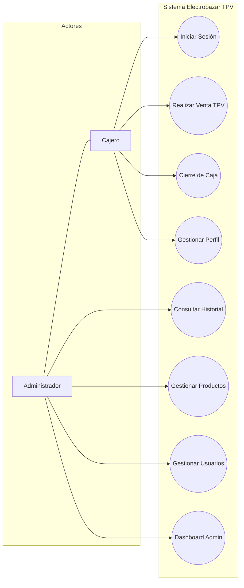
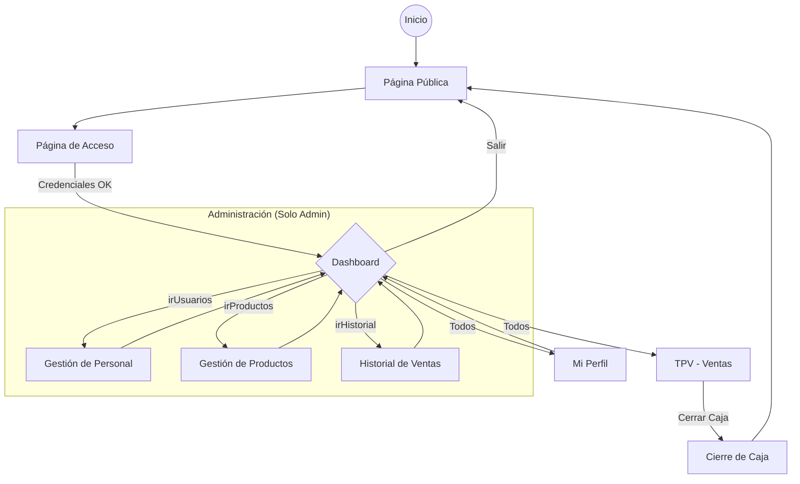
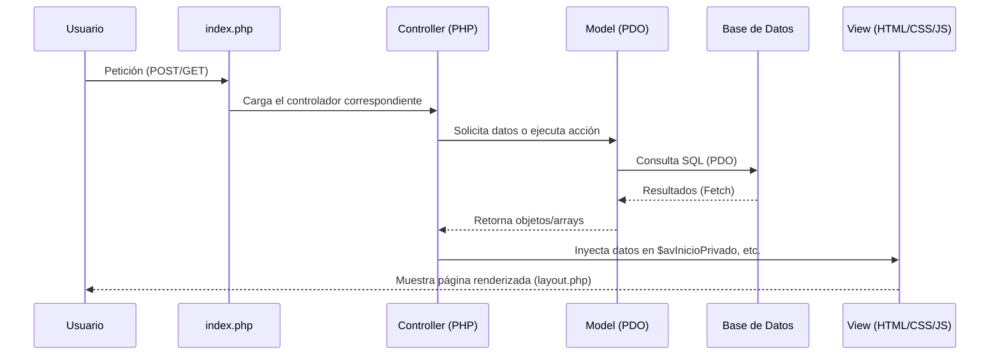
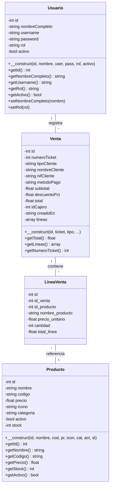

# Diagramas de Arquitectura y Funcionamiento: Electrobazar TPV

Este documento presenta una visión técnica y funcional de la aplicación TPV mediante diagramas que detallan su estructura, flujo de navegación y capacidades de usuario.

---

## 1. Diagrama de Casos de Uso
Define las interacciones de los diferentes tipos de usuarios con el sistema.

---

## 2. Diagrama de Navegación
Muestra el flujo de pantallas y cómo el Dashboard actúa como concentrador según el rol.

---

## 3. Arquitectura MVC (Model-View-Controller)
Detalla cómo se procesa una petición desde que el usuario interactúa hasta que se muestra la respuesta.

---

## 4. Estructura de Datos (Modelos Completos)
Estructura técnica de las clases del sistema.

